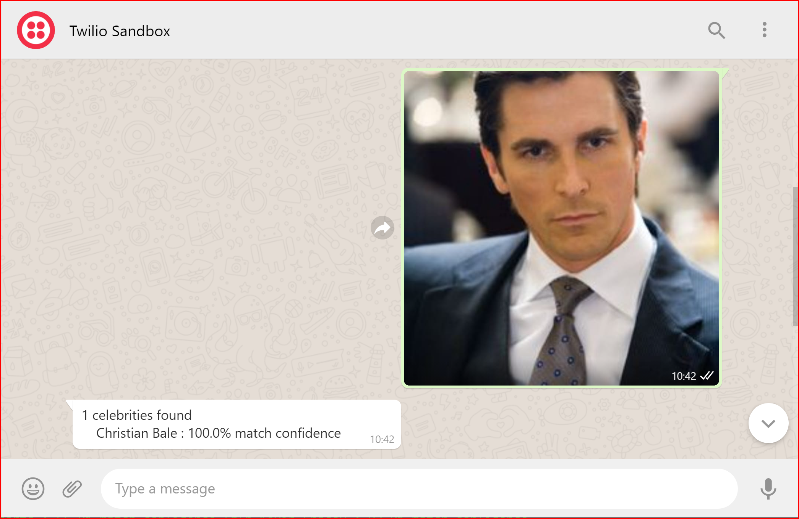

# Objective
Set up a Serverless project that can be connected to a Twilio Whatsapp account/sandbox to send and receive media files for image recognition by AWS Rekognition via AWS Lambda

## Pre-requisites

To have serverless setup , refer to 'Pre-requisites after cloning project' listed in [this link](https://github.com/anilmenon14/TwilioAWSLambda#pre-requisites-after-cloning-project)  

**Note:** You can choose to skip steps which ask to set up Twilio Account SID , Auth Token, 'from' and 'to' numbers since these are only needed to send outbound messages from Twilio to recipients. In our project, we are initiating a message from our WhatsApp account to Twilio whatsapp sandbox/business account and expecting a response back on the same number.

## How to link your phone to the Twilio

However, you still need to have a way for Twilio to be able to accept messages from your phone.
To do this, follow instructions from [official Twilio website](https://www.twilio.com/docs/whatsapp/sandbox) to create an account and link your phone to the Twilio sandbox number they assign to your account using the `join <secret-phrase>` first message to the sandbox.

Once done, to have Twilio interact with your AWS serverless stack, you need to have a webhook linked to your Twilio account . Refer to 'Configure your Webhook URL' part of [this link](https://www.twilio.com/docs/sms/tutorials/how-to-receive-and-reply-node-js)
The webhook link to use is the one that shows under 'endpoints' once you have deployed your serverless stack using command `serverless deploy` from your project root folder after you have completed pre-requisites.

## Workflow overview:

1. User sends an image in form of screenshot or jpeg/png file to the Twilio sandbox number.
2. The Twilio account receives the media file and makes a call to the webhook.
3. The webhook is an HTTP end point for AWS lambda , which sends the image to AWS Rekognition.
4. Rekognition responds back with the celebrities identified.

## How things should look like:

#### Clearly, Alfred got it right with the Bat suit....

  

  

#### Apparently Ryan Toolson can be cast as Captain America if Chris Evans declines to extend his contract....

  
